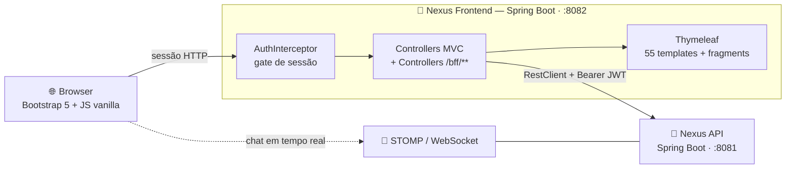

<div align="center">

# 🌿 Nexus — Frontend (1ª geração)

### Interface original do Hub Inteligente de Oportunidades de Trabalho

*Spring Boot · Thymeleaf · Bootstrap — o BFF server-side que deu forma ao produto*

[](https://openjdk.org/projects/jdk/21/)
[](https://spring.io/projects/spring-boot)
[](https://www.thymeleaf.org/)
[](https://getbootstrap.com/)

[](https://github.com/DanielGaiguer/Nexus-Frontend-NextJS)

**[Backend (API)](https://github.com/DanielGaiguer/Nexus-Backend)** ·
**[Frontend atual (Next.js)](https://github.com/DanielGaiguer/Nexus-Frontend-NextJS)**

</div>

---

> ### ⚠️ Projeto legado
>
> Esta é a **interface de 1ª geração** do Nexus. Ela foi inteiramente migrada para o
> **[Nexus-Frontend-NextJS](https://github.com/DanielGaiguer/Nexus-Frontend-NextJS)**,
> que é o frontend ativo do produto.
>
> Este repositório é mantido como **referência histórica e de paridade**: foi contra
> estas telas que a migração foi auditada, tela por tela. Continua funcional e pode
> ser executado normalmente contra a mesma API.

---

## 📑 Sumário

- [Sobre o projeto](#-sobre-o-projeto)
- [O papel desta aplicação](#-o-papel-desta-aplicação)
- [Arquitetura](#-arquitetura)
- [Telas implementadas](#-telas-implementadas)
- [Stack](#-stack)
- [Estrutura do código](#-estrutura-do-código)
- [Como executar localmente](#-como-executar-localmente)
- [Por que migramos para Next.js](#-por-que-migramos-para-nextjs)
- [Ecossistema Nexus](#-ecossistema-nexus)

---

## 🎯 Sobre o projeto

O **Nexus** é uma plataforma de intermediação entre contratantes e profissionais de TI, desenvolvida como Trabalho de Conclusão de Curso. Em vez de busca manual em listas infinitas, um **motor de matchmaking algorítmico** calcula a compatibilidade entre cada profissional e cada oportunidade e apresenta os dois lados já ranqueados — o interesse precisa ser **mútuo** para que os contatos sejam liberados.

Este repositório contém a **primeira interface completa** do sistema: uma aplicação Spring Boot renderizada no servidor que consome a [API Nexus](https://github.com/DanielGaiguer/Nexus-Backend).

---

## 🧭 O papel desta aplicação

Esta aplicação **não tem banco de dados nem regra de negócio**. Ela é um **BFF (Backend for Frontend) server-side**:

1. Recebe a navegação do usuário;
2. Chama a API Spring Boot (`nexus`) via `RestClient`, repassando o JWT da sessão;
3. Monta o `Model` e renderiza a página em Thymeleaf;
4. Expõe um punhado de rotas `/bff/**` para o JavaScript da página consumir via `fetch` (chat, diretório, avaliações, skills, extração por IA, simulador de score).

O JWT fica guardado na **sessão HTTP do servidor** — o browser nunca vê o token. Um `AuthInterceptor` protege as rotas e redireciona quem não tem sessão válida para o login.

---

## 🏗️ Arquitetura



| Camada | Responsabilidade |
|---|---|
| `config/AuthInterceptor` | Gate de sessão — redireciona para `/login` quem não estiver autenticado |
| `config/WebConfig` | Registro do interceptor e configuração do `RestClient` |
| `controller/*Controller` | Controllers MVC que montam o `Model` e devolvem o nome da view |
| `controller/*BffController` | Endpoints JSON consumidos pelo JavaScript da página |
| `model/*DTO` | Espelho dos DTOs da API — desserialização das respostas |
| `exception/` | `NexusApiException` e `NexusAuthException`, traduzidas em mensagem de tela |

---

## 🖥️ Telas implementadas

**55 templates Thymeleaf**, organizados por perfil:

| Área | Telas |
|---|---|
| 🔓 **Público / auth** | Home, login, cadastro de profissional, cadastro de contratante (tradicional e via LinkedIn), sucesso de cadastro, perfil público de profissional e de empresa, avaliações públicas, detalhe de oportunidade |
| 👨‍💻 **Profissional** | Dashboard, perfil, portfólio, oportunidades, matches, mapa, analytics, diretório de empresas e de profissionais, visualização de empresa |
| 🏢 **Empresa** | Dashboard, perfil, projetos e formulário de projeto, ranking de candidatos, comparador de candidatos, matches, oportunidades, mapa, analytics, diretórios, visualização de profissional |
| 🛡️ **Admin** | Dashboard, aprovações, usuários, profissionais, empresas, projetos, skills, mapa, perfis detalhados |
| 🔄 **Transversal** | Chat e lista de conversas, avaliação de match, verificação de status do match, fragments compartilhados (shell, header, footer, componentes) |

**JavaScript de apoio** (vanilla, sem framework): chat e socket STOMP, notificações, mapa com filtros e raio de distância, diretório, seletor de skills, completude de perfil, simulador de score, validações de formulário.

---

## 🛠️ Stack

| Camada | Tecnologia |
|---|---|
| Linguagem | Java 21 |
| Framework | Spring Boot 4.1 |
| Templates | Thymeleaf + Thymeleaf Layout Dialect |
| UI | Bootstrap 5 · CSS próprio com a paleta de marca do Nexus |
| Interatividade | JavaScript vanilla · STOMP sobre WebSocket · Leaflet (mapa) · Cropper.js (corte de foto) |
| HTTP | `RestClient` do Spring |
| Sessão | Sessão HTTP do servidor guardando o JWT |
| Dev | Spring Boot DevTools (restart + livereload) |

---

## 📁 Estrutura do código

```text
src/main/
├── java/com/main/nexus_frontend/
│   ├── config/         # AuthInterceptor, WebConfig
│   ├── controller/     # Controllers MVC + controllers /bff/**
│   ├── model/          # DTOs espelhando as respostas da API
│   └── exception/      # NexusApiException, NexusAuthException
└── resources/
    ├── templates/      # 55 páginas Thymeleaf
    │   ├── admin/  chat/  company/  pro/  public/  matches/
    │   ├── fragments/  # app-shell, head, header, footer, components
    │   └── shared/
    ├── static/
    │   ├── css/        # style.css — paleta de marca (--nexus-*)
    │   ├── js/         # nexus-chat, nexus-map, nexus-score-simulator, …
    │   └── images/
    └── application.properties
```

---

## 🚀 Como executar localmente

### Pré-requisitos

- ☕ **Java 21+**
- 🧩 O **[backend Nexus](https://github.com/DanielGaiguer/Nexus-Backend)** rodando em `http://localhost:8081`

```bash
git clone https://github.com/DanielGaiguer/Nexus-Frontend.git
cd Nexus-Frontend

./mvnw spring-boot:run          # Linux / macOS
mvnw.cmd spring-boot:run        # Windows
```

A interface sobe em **`http://localhost:8082`**.

Configuração relevante em `src/main/resources/application.properties`:

| Propriedade | Padrão | Para quê |
|---|---|---|
| `server.port` | `8082` | Porta desta aplicação |
| `nexus.api.base-url` | `http://127.0.0.1:8081/api` | Base da API, usada nas chamadas servidor-a-servidor |
| `nexus.ws.base-url` | `http://localhost:8081` | Base do WebSocket, usada pelo browser no chat |

> 💡 `nexus.api.base-url` usa `127.0.0.1` de propósito: no Windows, a resolução de `localhost` pelo Java às vezes tenta IPv6 (`::1`) antes do IPv4, causando lentidão e instabilidade nas chamadas servidor-a-servidor.

---

## 🔄 Por que migramos para Next.js

A arquitetura server-side cumpriu bem o papel de dar forma ao produto, mas cobrava um preço a cada nova tela:

| Limitação aqui | Como o [frontend Next.js](https://github.com/DanielGaiguer/Nexus-Frontend-NextJS) resolve |
|---|---|
| Todo `submit` recarrega a página | Mutations com TanStack Query, sem reload |
| Feedback por `alert-success`/`alert-danger` estáticos | Toasts contextuais no `onSuccess`/`onError` |
| `confirm()` e `alert()` nativos do browser | `AlertDialog` com o texto claro da consequência |
| Listas sem estado de carregamento | `Skeleton` e `EmptyState` padronizados |
| Só tema escuro | Dark **e** light com contraste AA |
| Responsividade herdada do Bootstrap | Mobile-first explícito em cada componente |
| Estado espalhado entre `Model` e JS vanilla | Cache e invalidação centralizados no TanStack Query |

A migração foi feita **tela por tela**, com auditoria formal de paridade ao final — o diário completo dessa migração está em [`docs/historico-migracao.md`](https://github.com/DanielGaiguer/Nexus-Frontend-NextJS/blob/master/docs/historico-migracao.md) no repositório sucessor.

---

## 🌐 Ecossistema Nexus

| Repositório | Papel | Stack | Porta |
|---|---|---|:---:|
| **[Nexus-Backend](https://github.com/DanielGaiguer/Nexus-Backend)** | API REST, regras de negócio e motor de score | Java 21 · Spring Boot 4 · MySQL | `8081` |
| **[Nexus-Frontend-NextJS](https://github.com/DanielGaiguer/Nexus-Frontend-NextJS)** | Interface atual do produto | Next.js 16 · React 19 · TypeScript · Tailwind v4 | `3000` |
| **[Nexus-Frontend](https://github.com/DanielGaiguer/Nexus-Frontend)** *(este)* | Interface de 1ª geração (legado, referência de paridade) | Spring Boot · Thymeleaf · Bootstrap | `8082` |

---

<div align="center">

## 👨‍💻 Autor

Desenvolvido por **[Daniel Gaiguer](https://github.com/DanielGaiguer)**

Trabalho de Conclusão de Curso — Desenvolvimento de Sistemas

⭐ *Se este projeto te interessou, deixe uma estrela no repositório.*

</div>
